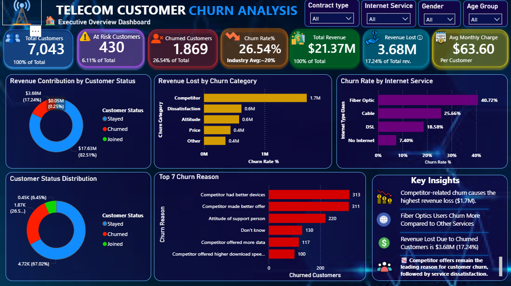
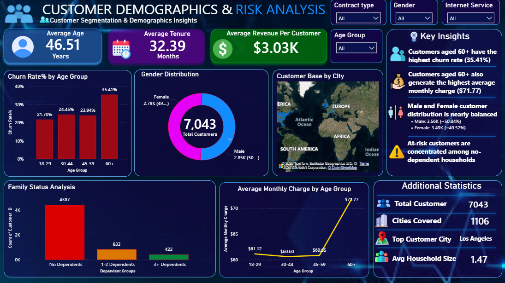
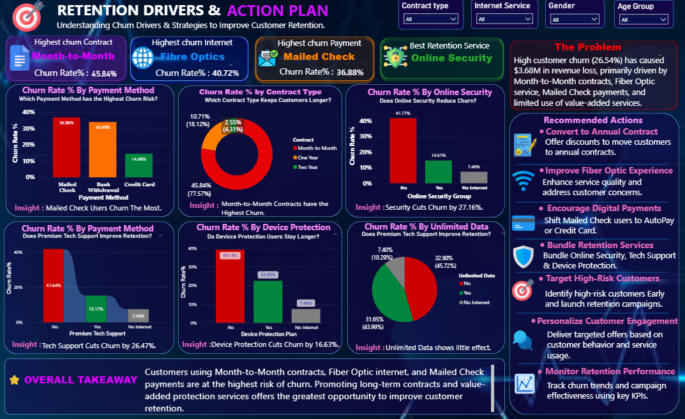

# 📊 Telecom Customer Churn Analysis Dashboard

## 📌 Project Overview

This project presents an interactive **Power BI Customer Churn Analysis Dashboard** designed to analyze customer behavior, identify the key factors driving customer churn, measure its financial impact, and recommend data-driven retention strategies. The dashboard transforms raw telecom customer data into meaningful business insights through interactive visualizations, KPIs, and executive-level reporting.

---

## 🎯 Business Objective

- Analyze customer churn trends.
- Identify high-risk customer segments.
- Measure revenue loss due to churn.
- Discover key churn drivers.
- Recommend actionable strategies to improve customer retention.

---

## 🛠️ Tools & Technologies

- Microsoft Power BI
- Power Query
- DAX (Data Analysis Expressions)
- Microsoft Excel

---

# 📈 Dashboard Structure

## 📍 Page 1 – Executive Overview

Provides a high-level business summary including:

- Total Customers
- Churn Rate
- Total Revenue
- Revenue Lost
- Churn by Internet Service
- Revenue Lost by Churn Reason
- Top Churn Reasons
- Executive Insights

---

## 👥 Page 2 – Customer Demographics & Risk Analysis

Analyzes customer demographics to identify high-risk customer segments.

Visuals include:

- Customer Distribution by Gender
- Customer Distribution by Age Group
- Revenue by Age Group
- Churn by Dependents
- Customer Distribution by City
- Key Customer Insights

---

## 🎯 Page 3 – Churn Drivers & Retention Strategy

Identifies the major factors influencing customer churn and provides business recommendations.

Visuals include:

- Churn by Contract Type
- Churn by Payment Method
- Online Security Analysis
- Premium Tech Support Analysis
- Device Protection Analysis
- Unlimited Data Analysis
- Business Problem Statement
- Recommended Business Actions

---

# 📊 Key Insights

- Month-to-Month contract customers have the highest churn rate.
- Fiber Optic customers experience significantly higher churn.
- Customers using Mailed Check are more likely to churn.
- Online Security, Premium Tech Support, and Device Protection significantly reduce churn.
- Competitor-related reasons contribute to the highest revenue loss.
- Unlimited Data has minimal impact on customer retention.

---

# 🚀 Business Recommendations

- Promote long-term contracts through targeted offers.
- Improve Fiber Optic customer experience.
- Encourage customers to adopt digital payment methods.
- Bundle Online Security, Premium Tech Support, and Device Protection.
- Launch proactive retention campaigns for high-risk customers.
- Monitor retention KPIs to evaluate business performance.

---

# 📸 Dashboard Preview

## 📍 Executive Overview



---

## 👥 Customer Demographics & Risk Analysis



---

## 🎯 Churn Drivers & Retention Strategy



---

# 📂 Dataset

The dataset contains telecom customer information including:

- Customer Demographics
- Internet Services
- Contract Details
- Payment Methods
- Revenue Information
- Customer Status
- Churn Information

### Data Cleaning

Blank values in internet-related service columns were replaced with **"No Internet Service"** to correctly represent customers who do not subscribe to internet services rather than treating them as missing values.

---

# ⭐ Skills Demonstrated

- Data Cleaning
- Data Transformation
- Data Modeling
- DAX Measures
- KPI Development
- Dashboard Design
- Data Visualization
- Customer Churn Analysis
- Business Intelligence
- Business Storytelling
- Executive Reporting

---

# 📁 Repository Structure

```
PowerBI-Telecom-Customer-Churn-Analysis
│
├── Customer_Churn_Analysis.pbix
├── Telecom_Churn_Cleaned.xlsx
├── Telecom_Customer_Churn_Dashboard.pdf
├── README.md
├── Page1.png
├── Page2.png
└── Page3.png
```

---

# ⭐ About Me

Aspiring **Data Analyst** passionate about transforming raw data into actionable business insights using **SQL, Python, Power BI, and Excel**. I enjoy solving real-world business problems through data analysis, visualization, and storytelling.

---

# 👤 Author

**Dhiwahar B**

📧 Email: **dhiwaharb@gmail.com**

🔗 GitHub: **https://github.com/dhiwaharb-web**

🔗 LinkedIn: **https://www.linkedin.com/in/dhiwahar-b-2b921a320**

---

## 📜 License

This project is created for **educational and portfolio purposes**.
